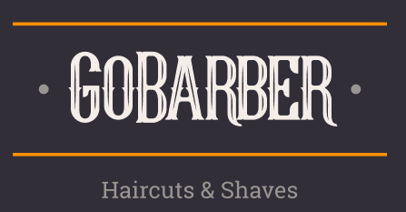

<h1 align="center">
    
</h1>

<h4 align="center"> 
	:heavy_check_mark: 🚀 App GoBarber - Bootcamp Rocketseat :heavy_check_mark:
</h4>

<p align="center">
  <a href="#-project">Projeto</a>&nbsp;&nbsp;&nbsp;|&nbsp;&nbsp;&nbsp;
  <a href="#rocket-Technologies">Tecnologias</a>&nbsp;&nbsp;&nbsp;|&nbsp;&nbsp;&nbsp;
  <a href="#-layout">Layout</a>&nbsp;&nbsp;&nbsp;|&nbsp;&nbsp;&nbsp;
  <a href="#-how-to-use">Como usar</a>&nbsp;&nbsp;&nbsp;|&nbsp;&nbsp;&nbsp;
  <a href="#-how-to-contribute">Como contribuir</a>&nbsp;&nbsp;&nbsp;|&nbsp;&nbsp;&nbsp;
  <a href="#memo-license">Licença</a>
</p>

## 💻 Project

<p>O App GoBarber foi desenvolvido para que o cliente da barbearia possa fazer o agendamento do corte de seu cabelo ou barba escolhendo uma data na agenda de qualquer um dos barbeiros disponíveis naquele dia. Através do app, ele pode atualizar as informações de seu perfil e seu Avatar. Já o barbeiro, caso ele queira gerenciar sua agenda, existe uma aplicação web que lhe permite fazer isso, além de gerencias informações de seu perfil. Conheça a aplicação clicando neste link &nbsp;&nbsp; <a href="#">Aplicativo Web do Barbeiro</a>   </p>

<p align="center">    
  
  
   
 </p>


## :rocket: Technologies

Esse projeto foi desenvolvido com as seguintes tecnologias:

- [ReactNative](https://reactnative.dev/) 
- [Typescript](https://www.typescriptlang.org/docs/home.html)

## :information_source: How To Use

Para clonar a aplicação, você necessitará do [Git](https://git-scm.com), [ReactNative][reactnative] + [Yarn][yarn] instalados em seu computador.

From your command line:

### Install API
```bash
# Clone this repository
$ git clone https://github.com/ApoOliveira18/app-GoBarber.git
# Go into the repository
$ cd app-GoBarber/

# Install dependencies for directories
$yarn

```

## 🤔 How to contribute

- Make a fork;
- Create a branck with your feature: `git checkout -b my-feature`;
- Commit changes: `git commit -m 'feat: My new feature'`;
- Make a push to your branch: `git push origin my-feature`.

After merging your receipt request to done, you can delete a branch from yours.

## :memo: License

This project is under the MIT license. See the [LICENSE](LICENSE.md) for details.

---

Feito com ♥ && 🎧 && 😊 || 😥 
 por Adilson Oliveira :wave: [Get in touch!] www.linkedin.com/in/adilson-p-oliveira

[nodejs]: https://nodejs.org/
[yarn]: https://yarnpkg.com/
[vc]: https://code.visualstudio.com/
[vceditconfig]: https://marketplace.visualstudio.com/items?itemName=EditorConfig.EditorConfig
[vceslint]: https://marketplace.visualstudio.com/items?itemName=dbaeumer.vscode-eslint
[prettier]: https://marketplace.visualstudio.com/items?itemName=esbenp.prettier-vscode
[reactnative]: https://reactnative.dev/
[typescript]: https://www.typescriptlang.org/docs/home.html


